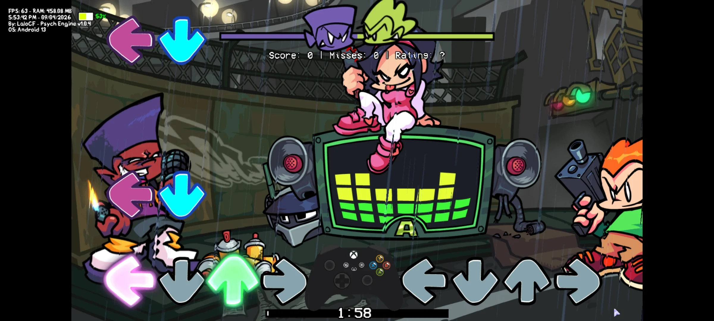

# 🎮 Controller-Engine (Psych Engine Script)

**Controller-Engine** es un script avanzado para **Friday Night Funkin' (Psych Engine)** que añade un control de mando virtual completamente funcional directamente en tu pantalla. 

Ideal para mejorar la accesibilidad y la experiencia de juego tanto en **PC** como en **dispositivos móviles**.

---

## ✨ Características Principales
* **Multiplataforma:** Optimizado para funcionar perfectamente en dispositivos móvile como Android/iOS.
* **Funcionalidad Total:** Los botones responden en tiempo real con latencia mínima.
* **Estética Integrada:** Diseñado para no obstruir la visión del gameplay.
* **Fácil Instalación:** Solo arrastra y suelta en la carpeta de mods.

## 🚀 Instalación

1. Descarga el archivo `Controller Engine.zip` (o la carpeta del mod) desde la sección de [Releases](enlace-a-tus-releases).
2. Ve a la carpeta principal de tu Psych Engine.
3. Pega el archivo en `mods/`.
4. ¡Inicia el juego y disfruta!

## 📸 Captura

## 🛠️ Requisitos
* Psych Engine v1.0.4 (recomendado).
* Soporte para Scripts Hx habilitado.

---

## 🤝 Contribuciones
¡Las sugerencias son bienvenidas! Si encuentras un error o tienes una idea para mejorar el diseño del mando, por favor abre un **Issue** o envía un **Pull Request**.

---
Desarrollado con ❤️ para la comunidad de FNF.

